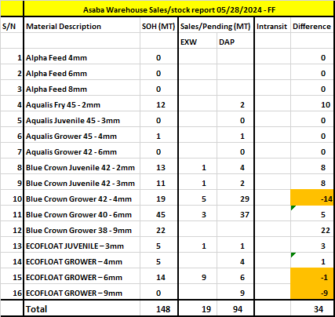

# Project-Documentation-
## Outline
This project aims providing customers with necessary information to serve them better.

## Data source

## Tools used
---
- Ms Excel for cleaning Data [Download here](https://Microsoft.com)
- Microsoft Power BI
- **SQL**
```
Google Query Sheet
SELECT * FROM TABLE 1
WHERE CONDITION = NET
```

|Name|Material Description| Quantity
|----|--------------------| --------
|Hope Alive| Aqualis 2mm| 500
|Junni| Bluecrown 9mm| 1800
|Nkem| Ecofloat 4mm|900
